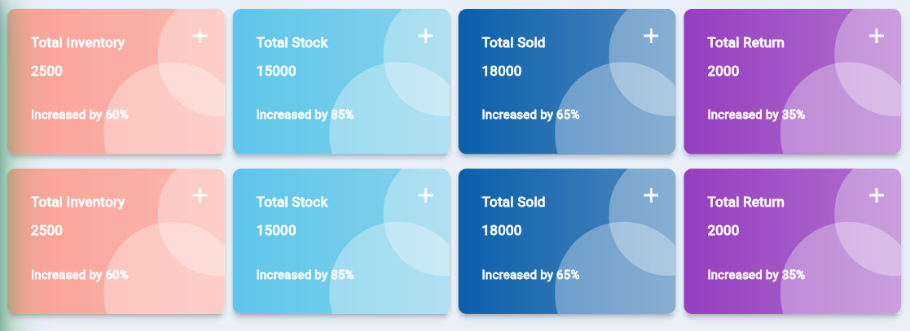

This is Different type of container. mixed with card and container
all the featured can control 

## Features

TODO: List what your package can do. Maybe include images, gifs, or videos.

so lets enjoy

```dart
@override
Widget build(BuildContext context) {
  return CardTypeContainer(
    title: "Total Inventory",
    subTitle: "2500",
    message: "Increased by 60%",
    color: const Color(0xffFBA197),
    iconData: const Icon(Icons.add),
    title: "your title ",
    titleTextStyle :TextStyle(),//your title style
    subTitle:"your subtitle",
    subTitleTextStyle :TextStyle(),//your sub title style
    message: "your message",
    messageTextStyle :TextStyle(),//your message style
    color:Colors.red,//your container color 
    padding: 30,
    rowItem: 4,// how many item you want to show a particular row 
    height: 200,//container height
    width: 200,//container width
   elevation: 5,//card elevation

  );
}
```
this type of card you can use easily


